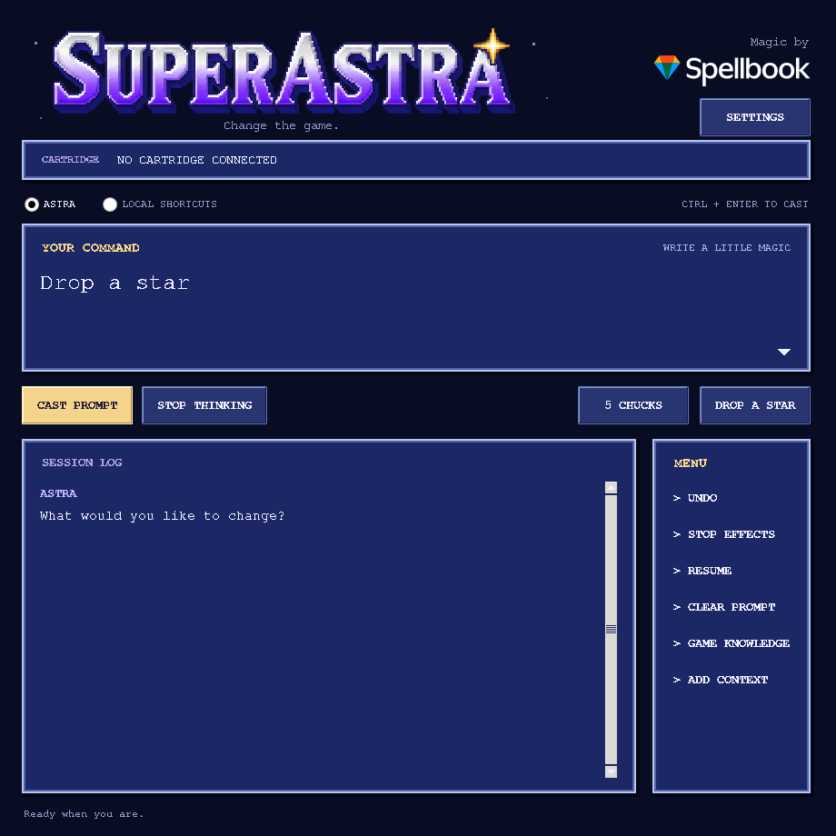

# SUPERASTRA

**Change the game.**

A SNES-themed desktop companion that lets Astra investigate and alter a running
game through natural-language prompts. Built for BizHawk, with an RPG-style
interface and live memory tools.



The agent can inspect the actual game, find memory structures, write new memory
routines or cartridge patches, test the result, and keep what it learns for that
exact cartridge version. The same investigation tools are available for an
unrecognized game and a previously unseen request.

This **v0.3.2 prototype** has passed real Snes9x game-behavior tests and automated
Lua/protocol checks. The Windows Lua bridge connection has also been confirmed manually.
See [validation notes](docs/VALIDATION.md) for the scope of these checks.

## Start playing

You need **Windows or Linux**, **Python 3.10 or newer with Tkinter**, a current
[BizHawk release](https://github.com/TASEmulators/BizHawk/releases), your ROM, and
an OpenAI API key whose project can use `gpt-6-astra`.

1. Extract this entire folder somewhere writable. Keep its files together.
2. Double-click `Start-Windows.cmd`, or run `python3 run.py` on Linux.
3. In BizHawk, open the ROM. Use its **BSNES** SNES core. Open
   **Tools → Lua Console**, then open `LOAD-IN-BIZHAWK.lua` from this folder.
4. Keep emulation running. The companion will show the cartridge name.
5. Open **Settings**, enter your API key, and leave the model as
   `gpt-6-astra`. Type what you want and click **Cast prompt**.

This runs alongside the desktop emulator. It is not an iPhone emulator extension
and is not a hosted website. The app requires no Python packages beyond the
standard library. Linux distributions sometimes package Tkinter separately as
`python3-tk`.

### Does it work while I play?

That is the intended workflow. The companion reads the running game, and Lua
applies changes between frames. Emulation continues while Astra thinks or
researches. A request is not instantaneous: it can require several API calls
and observations. Generated ongoing effects execute locally each frame without
an API call for each update.

Controlled experiments temporarily run an earlier checkpoint and return to the
player's pre-experiment state. They can visibly interrupt play for up to 300
emulated frames per trial. This prototype uses the same emulator for those
trials; it does not run a separate invisible emulator in the background.

The live engine behavior has been tested through Snes9x. Native BizHawk and a
live Astra request still require an end-to-end desktop test.

## Prompts and unfamiliar games

Try the original examples in Super Mario World:

- “Drop a star.”
- “Put 5 Chucks on the screen.”
- “Make a new effect that gives me a cape whenever I collect a coin.”

For another game, ask directly for the alteration. Examples of investigation
requests include “Find my health and keep it full while I'm playing” or “Figure
out how this game stores enemies so we can spawn another one.” These are requests
for Astra to investigate, not claims that those behaviors have been tested in
every game.

The agent receives:

| Context | What it can do with it |
| --- | --- |
| Live screenshot | Identify characters, objects, menus and visible results |
| Cartridge hash, headers and vectors | Identify the exact version and investigate its mapping |
| Local cartridge index | Read or search actual code and data without uploading the whole ROM |
| CPU registers and disassembly | Follow implementation details where the emulator core supports them |
| WRAM reads and scans | Find values, object tables and state flags |
| Hardware-domain reads | Inspect exposed VRAM, OAM, CGRAM, audio RAM and cartridge RAM |
| Frame observations and controller probes | Compare values with what happens during play |
| Named checkpoints and experiments | Test a hypothesis against the same starting state, capture results, then restore the player state |
| CPU bus write watch | See which registers/code are associated with a write, on supporting cores |
| Persistent game notebook | Reuse a working plan, hypotheses, evidence, previous routines and automatically recorded tool results |
| Optional web research | Find disassemblies and memory documentation, then check against the ROM |
| Searchable source collection | Import full text/source files using **Add context**, then retrieve relevant symbols and numbered lines |

The general path works without a recognized game profile. Astra can create a new
one-shot routine, an effect that runs each frame, or a guarded patch to code/data
in the loaded cartridge. The built-in Mario actions provide optional shortcuts.

**“Any game, any prompt” describes the interface and investigation goal, not a
guarantee of success.** The model still has to discover the right structures and
verify its reasoning. An unfamiliar game can take multiple requests or need
user observations, source notes or additional reverse engineering. Some requests
need new assets, more cartridge space, a coprocessor debugger or a larger game
engine rewrite. This version can edit existing loaded cartridge bytes; it cannot
expand the ROM, create an exportable ROM patch, synthesize new artwork, or debug
every special chip. Astra must identify a missing capability or unknown mechanic
and report it honestly. No implementation can guarantee every imaginable prompt.

### How an unfamiliar game gains context

1. Read the screen, ROM identity/header candidates, registers and available domains.
2. Retrieve relevant saved knowledge, imported sources or primary web documentation.
3. Build a working model of the required mechanics: game mode, state fields,
   object lifecycle, initialization code and graphics dependencies as applicable.
4. Create a checkpoint. Compare a control run with one changed input or candidate
   alteration. Results include sampled values, WRAM differences and a branch screen.
5. Apply a successful candidate to the live game, verify it, and retain evidence.

Tool evidence is recorded automatically; hypotheses are kept separate from
verified findings. **Resume** resumes saved work, including after
restarting the companion. It refreshes live context and never automatically
replays an old mutation. The latest bounded tool transcript and a compact working
plan are retained; older tool evidence is searchable. The default is 32 API steps
per request, adjustable to 1–256 in settings or with `--steps`.

**Add context** accepts multiple UTF-8 source/text files, up to 8 MiB each,
32 files and 32 MiB total per ROM. Astra searches them locally and requests
relevant excerpts. Lexical search uses keywords, addresses and symbols. It does
not upload an entire imported source collection automatically. **Game knowledge** displays the retained plan, recent evidence and available sources.

## Undo and ongoing effects

Each committed memory mutation gets a full emulator checkpoint. **Undo** restores
the entire game to just before the last mutation, including gameplay since that
moment, with the loaded-cartridge byte journal restored as well. Up to eight
Undo states and four independent named experiment checkpoints are retained in memory.

**Stop effects** removes active routines, memory freezes and loaded-cartridge
patches. It leaves current WRAM values as they are. **Stop thinking** prevents the next AI tool
operation; it does not undo previous actions. Undo and Stop effects can also be
used while Astra is waiting for the API. An in-progress temporary experiment
is restored when cancelled. External state/ROM loads supersede the experiment.

Opening another ROM, loading a state externally, or restarting the Lua bridge
clears effects and checkpoints. Undo can restore earlier routines and cartridge
patches. Your original ROM file is never patched by this app. Cartridge changes
are limited to 4096 bytes per operation and 64 KiB of distinct journaled offsets
per bridge session; a core must expose writable ROM for these operations.

## What gets created on your computer

- `ipc/`: the connection token, short-lived requests/responses, the latest
  screenshot and a local cartridge copy for indexing. Start the app before
  loading the Lua script. Do not run two companion apps against the same folder.
- `knowledge/<ROM-SHA1>.json`: working context, findings, tool evidence, source
  metadata and generated routines. Up to 1000 findings and 500 tool events are
  retained, with bounded excerpts of large tool results.
- `knowledge/<ROM-SHA1>.investigation.json`: the latest bounded investigation
  transcript and status, including encrypted API reasoning items for continuation.
  Screenshots are omitted from the persisted transcript; a fresh one is requested.
- `knowledge/sources/<ROM-SHA1>/`: locally indexed imported text. Retained context
  is never executed merely because it exists. Astra decides what to reuse.
- `profiles/`: optional exact-hash field maps. No manual profile is needed to
  use the general agent tools.

API keys entered in settings are kept in memory, not written to these files. You
can instead set `OPENAI_API_KEY`; `OPENAI_MODEL` optionally overrides the model.
Prompts, screenshots, requested memory/code windows, notes and selected findings
are sent to OpenAI. Full cartridge and RAM dumps are processed locally. Enabling
web research also lets Astra send game-related search queries. API usage is
billed to the configured OpenAI project; the app shows token counts after a turn.

## Terminal use

Run these from the extracted folder:

```bash
python run.py --doctor
python run.py --status
python run.py --prompt "Drop a star"
python run.py --prompt "Find the code that updates my health" --no-web
python run.py --prompt "Continue" --steps 64
```

The explicit **Local Mario shortcuts** mode needs no API key. It understands a
few phrases, including the two original examples, and is useful for checking the
emulator connection:

```bash
python run.py --local --prompt "Drop a star"
python run.py --local --prompt "Put 5 chucks on the screen"
python run.py --local --prompt "Undo"
```

The supplied shortcuts accept the unmodified USA SMW SHA-1 and the exact Ice
Flower build used for game testing. Other revisions still have the general agent
tools. Vanilla sprite slots and level graphics limits still apply: a request for
five enemies needs five free slots, and Chucks may have missing or wrong tiles in
levels that do not load their graphics.

When loaded-cartridge patches are active, the verified-layout Mario shortcuts
are disabled; the general tools remain available to reassess the modified game.

## Updating

Stop the Lua bridge and companion, then replace their source files together with
this version. Preserve your existing `knowledge/` directory to keep discoveries;
the older notebook format is read automatically. Restart both components. Do not
mix files from different releases. Checkpoints exist only in the emulator session.

## If the connection does not respond

- If the Lua Console says `Open LOAD-IN-BIZHAWK.lua by its full path`, replace
  that launcher with the file from this release. Earlier versions incorrectly assumed
  BizHawk would expose the script filename through Lua debug information.
- Confirm the app and Lua script came from the same extracted folder.
- Keep BizHawk unpaused, including its background emulation setting when the
  companion window has focus.
- Check the Lua Console error output. If WRAM is unavailable, select the BSNES
  core and reopen the ROM and script.
- After a crash, close the crashed companion and remove `ipc/client.lock` if it
  remains. Do not remove another running app's lock.
- A timed-out mutation is never automatically repeated: it might have executed
  before its acknowledgement was lost. Inspect the game or use Undo.
- If Astra's API request is rejected, check the key's project, billing and access
  to the configured model. There is no automatic substitution of another model.

## Development

See [CONTRIBUTING.md](CONTRIBUTING.md) for development and release instructions,
[architecture](docs/ARCHITECTURE.md) for extension points, and
[validation](docs/VALIDATION.md) for exactly what was tested.

Unit/integration tests require the optional Lua test runtime:

```bash
python -m pip install -r requirements-dev.txt
python -m unittest discover -s tests -v
```

No emulator binary or commercial ROM is included. The small `json.lua` dependency
is included under its MIT license in `emulator/json-LICENSE.txt`. This project's
original source is MIT-licensed; see [LICENSE](LICENSE). The Spellbook logo is
a separate brand asset; see [asset credits](assets/README.md).

## Primary references

- [BizHawk Lua API](https://tasvideos.org/Bizhawk/LuaFunctions)
- [BizHawk source and releases](https://github.com/TASEmulators/BizHawk)
- [SMW Disassembly X](https://github.com/IsoFrieze/SMWDisX)
- [GPT-6 Astra model](https://developers.openai.com/api/docs/models/gpt-6-astra)
- [Responses function calling](https://developers.openai.com/api/docs/guides/function-calling)
- [Responses web search](https://developers.openai.com/api/docs/guides/tools-web-search)
